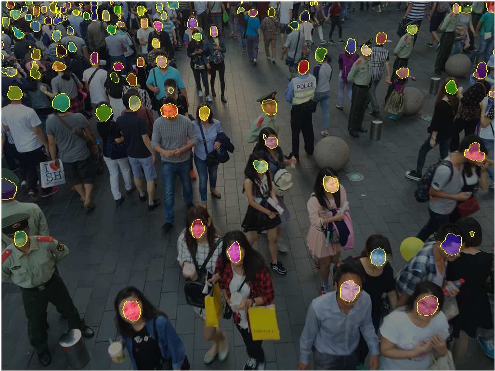

# LCFCN - ECCV 2018
## Where are the Blobs: Counting by Localization with Point Supervision
[[Paper]](https://arxiv.org/abs/1807.09856)[[Video]](https://youtu.be/DHKD8LGvX6c)

## Requirements

- Pytorch version 0.4 or higher.

## Description
Given a test image, the trained model outputs blobs in the image, then counts the number of predicted blobs (see Figure below).




## Running the saved models

1. Download the checkpoints,
```
bash checkpoints/download.sh
```

2. Output the saved results,

```
python main.py -m summary -e trancos
```

3. Re-evaluate the saved model,

```
python main.py -m test -e trancos
```


## Training the models from scratch

To train the model,

```
python main.py -m train -e trancos
```


## Benchmark

| Method           | Trancos | Pascal|
|------------------|---------|-------|
| ResFCN           | 3.39    | 0.31   |  
| Paper            | 3.32    | 0.31   | 


## Citation 
If you find the code useful for your research, please cite:

```bibtex
@Article{laradji2018blobs,
    title={Where are the Blobs: Counting by Localization with Point Supervision},
    author={Laradji, Issam H and Rostamzadeh, Negar and Pinheiro, Pedro O and Vazquez, David and Schmidt, Mark},
    journal = {ECCV},
    year = {2018}
}
```
