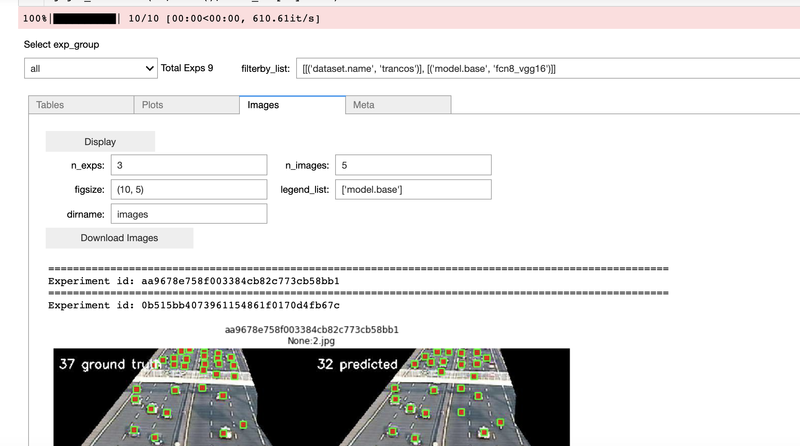

# LCFCN - ECCV 2018

## Where are the Blobs: Counting by Localization with Point Supervision
[[Paper]](https://arxiv.org/abs/1807.09856)[[Video]](https://youtu.be/DHKD8LGvX6c)

Make the segmentation model learn to count and localize objects by adding a single line of code. Instead of the cross-entropy loss on the per-pixels, apply the lcfcn loss.


## Usage

```
pip install git+https://github.com/ElementAI/LCFCN
```

```python
from lcfcn import lcfcn_loss

# compute an CxHxW logits mask using any segmentation model
logits = seg_model.forward(images)

# compute loss given 'points' as HxW mask (1 pixel label per object)
loss = lcfcn_loss.compute_lcfcn_loss(logits, points)
loss.backward()
```
## Predicted Object Locations


## Experiments

### 1. Install dependencies

```
pip install -r requirements.txt
```
This command installs pydicom and the [Haven library](https://github.com/ElementAI/haven) which helps in managing the experiments.


### 2. Download Datasets

- Shanghai Dataset
  
  ```
  wget -O shanghai_tech.zip https://www.dropbox.com/s/fipgjqxl7uj8hd5/ShanghaiTech.zip?dl=0
  ```
- Trancos Dataset 
  ```
  wget http://agamenon.tsc.uah.es/Personales/rlopez/data/trancos/TRANCOS_v3.tar.gz
  ```
<!-- 
#### Model
- Shanghai: `curl -L https://www.dropbox.com/sh/pwmoej499sfqb08/AABY13YraHYF51yw62Zc1w0-a?dl=0 `
- Trancos: `curl -L https://www.dropbox.com/sh/rms4dg5autwtpnf/AADQBOr1ruFsptbqG_uPt_zCa?dl=0` -->

#### 2.2 Run training and validation

```
python trainval.py -e trancos -d <datadir> -sb <savedir_base> -r 1
```

- `<datadir>` is where the dataset is located.
- `<savedir_base>` is where the experiment weights and results will be saved.
- `-e trancos` specifies the trancos training hyper-parameters defined in [`exp_configs.py`](exp_configs.py).

###  3. Results
#### 3.1 Launch Jupyter from terminal

```
> jupyter nbextension enable --py widgetsnbextension --sys-prefix
> jupyter notebook
```

####  3.2 Run the following from a Jupyter cell
```python
from haven import haven_jupyter as hj
from haven import haven_results as hr

# path to where the experiments got saved
savedir_base = <savedir_base>

# filter exps
filterby_list = [('dataset.name','trancos')]
# get experiments
rm = hr.ResultManager(savedir_base=savedir_base, 
                      filterby_list=filterby_list, 
                      verbose=0)
# dashboard variables
legend_list = ['model.base']
title_list = ['dataset', 'model']
y_metrics = ['val_mae']

# launch dashboard
hj.get_dashboard(rm, vars(), wide_display=True)
```

This script outputs the following dashboard


## Citation 
If you find the code useful for your research, please cite:

```bibtex
@inproceedings{laradji2018blobs,
  title={Where are the blobs: Counting by localization with point supervision},
  author={Laradji, Issam H and Rostamzadeh, Negar and Pinheiro, Pedro O and Vazquez, David and Schmidt, Mark},
  booktitle={Proceedings of the European Conference on Computer Vision (ECCV)},
  pages={547--562},
  year={2018}
}
```
